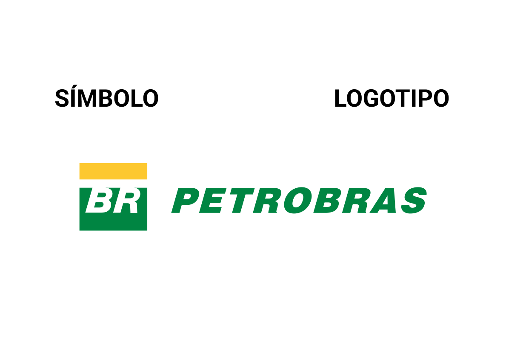

# Orientações da Marca

## Símbolo e logotipo

<figure><figcaption>
A nossa marca é uma composição entre símbolo e logotipo. O uso dissociado destes elementos é restrito a casos especiais.
</figcaption></figure>

##

## 🛠 How we build

We build with the justo odio, dapibus ac facilisis in, egestas eget quam. Fusce dapibus, tellus ac cursus commodo, tortor mauris condimentum nibh, ut fermentum massa justo sit amet risus. Cum sociis natoque penatibus et magnis dis parturient montes, nascetur ridiculus mus. Sed posuere consectetur est at lobortis. Morbi leo risus, porta ac consectetur ac, vestibulum at eros. Maecenas faucibus mollis interdum. Nulla vitae elit libero, a pharetra augue.
